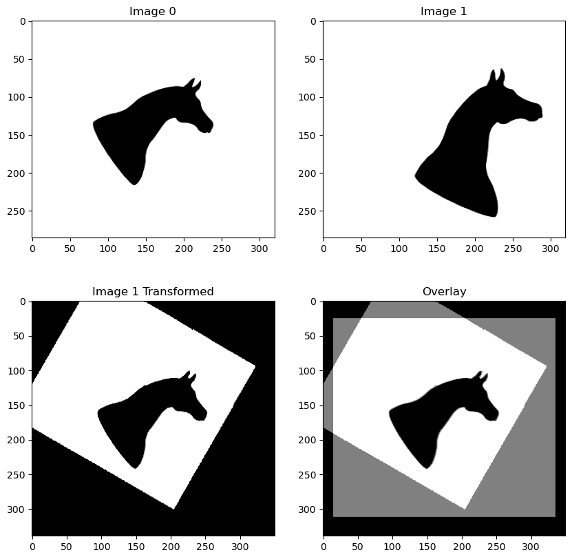

# Fourier-Mellin Transform \[NumPy Only!\]

## Description
This code implements the Fourier-Mellin Transform, a popular image registration algorithm that is invariant to translation, rotation, and scale. Since all of the existing Python code that implements this algorithm relies on external libraries such as `scikit-image` and `opencv-python`, I have chosen to write this code entirely using the `numpy` module! The only other library I use is `pillow` to read and save the images. All other operations are written in `numpy`. One of the most difficult aspects of this included applying a median filter quickly that didn't rely on python `for` loops; instead, I implemented a custom `unfold` function that operates similar to PyTorch's `Unfold` class. Using this function, one can implement any rank-based filter such as median, min, max, etc..

## Results

## Environment
Simply make sure you have `numpy` and `pillow` installed on any version of Python3:

`$ pip3 install numpy pillow`

## Running the Code
Simply modify the file paths in `main.py`. Then, run `$ python3 main.py` and the results will be saved to two files: `transformed_result.png` and `overlayed_result.png`. The first file shows the final transformed image, while the second shows an overlay of the original image and the newly transformed image.
